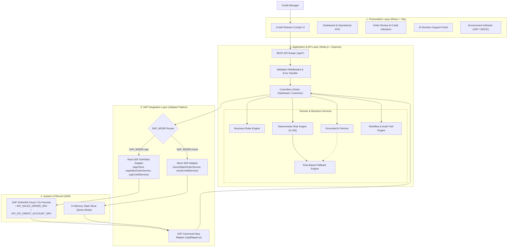

# AI-Powered Credit Release Cockpit — SAP Order-to-Cash (O2C)

An enterprise-grade, assessment-ready operational workbench built for **Credit Managers** managing credit-blocked sales orders within the **SAP Order-to-Cash (O2C)** business cycle.

The cockpit integrates a **deterministic risk engine**, a **grounded AI decision support layer**, and an isolated **SAP S/4HANA Integration Adapter** with seamless in-memory mock fallback.

---

## 1. Executive Summary & Problem Statement

In high-volume enterprise sales environments, sales orders that breach customer credit limits or overdue thresholds are automatically placed on **Credit Block** by SAP S/4HANA. 

Without an operational cockpit:
- Blocked orders sit in administrative queues awaiting manual credit reviews.
- Delivery creation, warehouse picking, and revenue realization are delayed.
- Customer relationships are strained due to delayed fulfillment.
- Credit Managers lack unified visibility into credit exposure, overdue liabilities, and transaction risk drivers.

The **AI-Powered Credit Release Cockpit** resolves these bottlenecks by providing:
1. **Real-Time Operational Cockpit**: Live KPIs tracking blocked orders, blocked order values, average release times, and customer exposure.
2. **Comprehensive Credit Review**: Deep visibility into customer credit limits, current exposure utilization, overdue liabilities, and order line items.
3. **Deterministic 0–100 Risk Engine**: An explainable scoring engine evaluating credit breach percentages, overdue severity, order size, and payment histories.
4. **Grounded AI Decision Support**: Context-aware AI recommendations (**RELEASE**, **HOLD**, **ESCALATE**) grounded strictly in SAP financial data with transparent fallback.
5. **Audited Workflow Actions**: Enforced state transitions with justification logging and non-repudiation audit trails.

---

## 2. End-to-End System Architecture

The application strictly adheres to clean multi-tier enterprise architecture. **SAP S/4HANA is the System of Record**, while **AI operates exclusively as an advisory Decision Support layer** (human-in-the-loop governance).



### Architectural Layer Responsibilities:
- **Presentation Layer (React)**: Consumes clean, normalized canonical domain models. Never directly interacts with SAP APIs or handles raw credentials.
- **Application Logic (Node.js/Express)**: Implements business rule validations, workflow state machines, and audit persistence.
- **Decision Support (Risk Engine + AI)**: Generates explainable risk scores and recommendation proposals. **AI is never permitted to execute state changes autonomously.**
- **Integration Adapter (Isolated Layer)**: Translates between SAP OData/REST schemas and canonical application models using `sapMapper.js`.
- **System of Record (SAP S/4HANA)**: Retains ultimate authority over customer balances, credit limits, and sales order commitments.

---

## 3. SAP Business Concepts & Domain Terminology

| Concept | Explanation |
| :--- | :--- |
| **SAP S/4HANA** | SAP's enterprise ERP suite. Serves as the authoritative **System of Record (SoR)** for financial transactions, customer masters, and logistics. |
| **Order-to-Cash (O2C)** | The end-to-end business process encompassing Customer Order Entry $\rightarrow$ Credit Check $\rightarrow$ Delivery Fulfillment $\rightarrow$ Billing $\rightarrow$ Payment Collection. |
| **Sales Order** | A legally binding contract in SAP representing a customer's request to purchase goods or services for specified prices and delivery dates. |
| **Sold-To Party (Customer)** | The entity that orders the goods and bears legal credit liability. Master record stores credit classifications and terms. |
| **Credit Limit** | The maximum allowable financial exposure established by the credit committee for a customer account. |
| **Credit Exposure** | The total committed liability of a customer, comprising open sales orders, unbilled deliveries, open billing documents, and accounts receivable. |
| **Credit Block** | An automated restriction placed on a sales order preventing downstream delivery creation when exposure exceeds limit or overdue thresholds are breached. |
| **Credit Manager** | The operational decision maker responsible for evaluating blocked transactions, assessing default risk, and executing Release, Hold, or Escalation. |
| **Integration Adapter** | A software layer isolating SAP-specific transport protocols, CSRF handling, and OData field structures from UI and core logic. |

---

## 4. Key Business Rules & Deterministic Risk Scoring

### Enforced Business Rules:
1. **Rule 1 (Credit Limit Exceeded)**: When $\text{Current Exposure} + \text{Order Value} > \text{Credit Limit}$, status is automatically set to `BLOCKED`.
2. **Rule 2 (Overdue Severity)**: Overdue debt exceeding configured threshold (₹100,000) raises the risk factor and triggers `ESCALATE` or `HOLD`.
3. **Rule 3 (Order Value Non-Negativity)**: Orders with $\text{Order Value} \le 0$ are rejected with `400 Bad Request`.
4. **Rule 4 (Customer Existence)**: Orders referencing non-existent customer master records are rejected with `404 Not Found`.
5. **Rule 5 (High-Risk Governance)**: High-risk orders cannot be released without an explicit business justification recorded in the audit log.
6. **Rule 6 (Workflow State Machine)**:
   - Permitted: `BLOCKED` $\rightarrow$ `UNDER_REVIEW` $\rightarrow$ `RELEASED` \| `HOLD` \| `ESCALATED`
   - Direct: `BLOCKED` $\rightarrow$ `RELEASED` \| `HOLD` \| `ESCALATED`
   - Terminal: `RELEASED` orders cannot be re-modified in the credit workbench.

### Deterministic Risk Scoring Formula (0–100 Points):
$$\text{Risk Score} = \text{Score}_{\text{Exposure}} (0\text{--}35) + \text{Score}_{\text{Overdue}} (0\text{--}30) + \text{Score}_{\text{OrderSize}} (0\text{--}20) + \text{Score}_{\text{PaymentHistory}} (0\text{--}15)$$

- **0 – 30 (LOW Risk)**: Standard release recommended.
- **31 – 60 (MEDIUM Risk)**: Temporary credit hold recommended.
- **61 – 100 (HIGH Risk)**: Escalation to senior finance leadership recommended.

---

## 5. Environment Configuration & SAP Switch

Configuration is managed via `backend/.env` without exposing any secrets to the frontend.

```env
# Mode toggle: 'mock' (default demo) or 'sap' (live S/4HANA)
SAP_MODE=mock

# S/4HANA Tenant Configuration (Used only when SAP_MODE=sap)
SAP_BASE_URL=https://your-s4hana-tenant.example.com
SAP_CLIENT=100
SAP_USERNAME=
SAP_PASSWORD=
SAP_AUTH_TYPE=basic
SAP_SALES_ORDER_ENDPOINT=/sap/opu/odata/sap/API_SALES_ORDER_SRV
SAP_CREDIT_ENDPOINT=/sap/opu/odata/sap/API_CR_CREDIT_ACCOUNT_SRV

# AI Service Configuration
AI_MODE=mock
AI_API_KEY=
AI_MODEL=gemini-1.5-flash
```

> [!NOTE]
> The cockpit displays an interactive status badge in the header indicating whether the system is operating in **DEMO / MOCK SAP MODE** or **SAP S/4HANA CONNECTED**.

---

## 6. Getting Started & Running the Cockpit

### Prerequisites
- Node.js `v16.20+` or `v18+`
- npm `8+`

### 1. Install Dependencies
```bash
# Install backend dependencies
cd backend
npm install

# Install frontend dependencies
cd ../frontend
npm install
```

### 2. Run Automated Verification Test Suite
Verify that all 8 core business rules and integration scenarios pass:
```bash
cd backend
npm test
```

### 3. Start the Backend Server (Port 5000)
```bash
cd backend
npm start
```
The server will start on `http://localhost:5000`.

### 4. Start the Frontend Application (Port 3000)
In a separate terminal:
```bash
cd frontend
npm run dev
```
Open **`http://localhost:3000`** in your browser.

---

## 7. Step-by-Step 2-Minute Demo Scenario

Follow this scripted walkthrough for presentations or assessment evaluations:

1. **Open Dashboard (`http://localhost:3000`)**:
   - Observe the **DEMO / MOCK SAP MODE** indicator in the navbar.
   - Review top KPI cards:
     - **Blocked Orders**: 4
     - **Blocked Order Value**: ₹32.00 Lakh
     - **Average Release Time**: 3.2 hrs
     - **High Risk Orders**: 5
     - **Total Credit Exposure**: ₹59.00 Lakh
2. **Filter and Locate Blocked Order `SO1001`**:
   - Notice `SO1001` for **ABC Manufacturing Ltd**: Value ₹8.5L, Status `BLOCKED`, Risk `HIGH`, Overdue ₹2.0L.
   - Click **[Review]** on `SO1001`.
3. **Inspect Order Review Screen (`/orders/SO1001`)**:
   - Notice the **Financial & Credit Profile**: Credit Limit is ₹10,00,000, Current Exposure is ₹8,00,000, and Overdue is ₹2,00,000.
   - Point out the **Credit Limit Utilization Bar**: Projected exposure is ₹16,50,000 (165% of limit — **Limit Exceeded**).
   - Review the **Line Items**: 15 Workstation Laptops (₹7,50,000) + 10 Ultra-Wide 4K Monitors (₹1,00,000) = ₹8,50,000.
4. **Execute AI Credit Risk Assessment**:
   - Click **[Run AI Assessment]** in the AI Decision Panel.
   - Watch the animated loading state (*"Analyzing credit risk with business rules & data grounding..."*).
   - Review the result:
     - **Risk Score**: 93 / 100 (**HIGH**)
     - **Recommendation**: **ESCALATE**
     - **Key Risk Drivers**: Identified severe credit breach (65% over limit) and ₹2.0L overdue liabilities.
     - **Executive Rationale**: Grounded explanation confirming that overdue balances require executive review.
5. **Execute Workflow Decision**:
   - Click **[ ESCALATE ]**.
   - In the modal dialog, provide justification: *"Overdue liabilities exceed ₹2 Lakh; escalating to VP Finance per credit policy."*
   - Click **Confirm ESCALATE**.
   - Note the success toast notification.
6. **Verify Audit Trail & Dynamic KPI Refresh**:
   - Scroll to the bottom of the review page: the **Decision Audit Trail** shows the new event with timestamp, user identity, and justification.
   - Click **Back to Cockpit Dashboard**.
   - Observe that **Blocked Orders** dropped from 4 to **3**, and **Blocked Order Value** decreased by ₹8.50 Lakh to **₹23.50 Lakh**.

---

## 8. REST API Reference

| Method | Endpoint | Description |
| :--- | :--- | :--- |
| `GET` | `/api/health` | Health check returning service status, timestamp, and active SAP/AI modes. |
| `GET` | `/api/dashboard/kpis` | Dynamic calculation of operational KPIs (blocked counts, values, avg duration). |
| `GET` | `/api/orders` | Retrieves sales order list with optional query filters (`status`, `search`). |
| `GET` | `/api/orders/:id` | Retrieves complete order details, line items, customer profile, and risk assessment. |
| `GET` | `/api/orders/:id/risk` | Pure deterministic risk engine score and breakdown (0–100). |
| `POST` | `/api/orders/:id/ai-assessment` | Grounded AI credit risk evaluation with automatic rule-based fallback. |
| `POST` | `/api/orders/:id/release` | Lifts credit block, validates business rules, and updates SAP/mock state. |
| `POST` | `/api/orders/:id/hold` | Places order on credit hold pending customer settlement or collateral. |
| `POST` | `/api/orders/:id/escalate` | Escalates high-risk order to executive management. |
| `GET` | `/api/customers/:id` | Fetches customer master and SAP credit account profile. |

---

## 9. Project Directory Structure

```
c:\safriya\KaarTech/
├── backend/
│   ├── src/
│   │   ├── config/
│   │   │   └── environment.js          # Config parser & secrets isolation
│   │   ├── data/
│   │   │   └── seedData.js             # Realistic 10 orders, 5 customers, line items
│   │   ├── integrations/
│   │   │   ├── index.js                # Mode switcher (SAP vs Mock)
│   │   │   ├── sap/
│   │   │   │   ├── sapClient.js        # Axios SAP client with CSRF & headers
│   │   │   │   ├── sapSalesOrderService.js # S/4HANA API_SALES_ORDER_SRV client
│   │   │   │   ├── sapCreditService.js # S/4HANA Credit Management client
│   │   │   │   └── sapMapper.js        # Canonical data model transformer
│   │   │   └── mock/
│   │   │       ├── mockSalesOrderService.js # In-memory stateful mock service
│   │   │       └── mockCreditService.js     # In-memory customer credit mock
│   │   ├── services/
│   │   │   ├── orderService.js         # Core domain service
│   │   │   ├── creditService.js        # Master customer service
│   │   │   ├── riskEngine.js           # 0-100 deterministic scoring engine
│   │   │   ├── aiService.js            # Grounded AI assessment + fallback
│   │   │   ├── workflowService.js      # Status transition rules & validations
│   │   │   └── dashboardService.js     # Live operational KPI calculations
│   │   ├── controllers/
│   │   │   ├── orderController.js
│   │   │   ├── dashboardController.js
│   │   │   └── customerController.js
│   │   ├── middleware/
│   │   │   ├── errorHandler.js         # Enterprise JSON error responses
│   │   │   └── validation.js           # ID & parameter sanitization
│   │   ├── routes/
│   │   │   ├── orderRoutes.js
│   │   │   ├── dashboardRoutes.js
│   │   │   └── customerRoutes.js
│   │   ├── app.js                      # Express app setup & CORS
│   │   └── server.js                   # HTTP server entrypoint
│   ├── tests/
│   │   └── businessRules.test.js       # 8-scenario verification test suite
│   ├── package.json
│   ├── .env.example
│   └── .env
│
├── frontend/
│   ├── src/
│   │   ├── components/
│   │   │   ├── Navbar.jsx              # SAP Fiori header + mode indicator
│   │   │   ├── KPICard.jsx             # Metric card tile
│   │   │   ├── StatusBadge.jsx         # Status badge (BLOCKED, RELEASED, etc.)
│   │   │   ├── RiskBadge.jsx           # Risk tier badge (LOW, MED, HIGH)
│   │   │   ├── OrderTable.jsx          # Sortable/filterable cockpit table
│   │   │   ├── CreditSummary.jsx       # Visual credit utilization progress bar
│   │   │   ├── OrderItemsTable.jsx     # Line items breakdown
│   │   │   ├── AIRiskPanel.jsx         # AI analysis & recommendation panel
│   │   │   ├── ActionButtons.jsx       # Decision actions with modal comments
│   │   │   ├── AuditTrail.jsx          # Workflow history log
│   │   │   └── Toast.jsx               # Feedback notifications
│   │   ├── pages/
│   │   │   ├── Dashboard.jsx           # Cockpit overview screen
│   │   │   └── OrderReview.jsx         # Order review & decision screen
│   │   ├── services/
│   │   │   └── api.js                  # Axios client for backend
│   │   ├── styles/
│   │   │   └── index.css               # SAP Fiori Morning Horizon theme
│   │   ├── App.jsx                     # Router config
│   │   └── main.jsx                    # React entrypoint
│   ├── index.html
│   ├── vite.config.js
│   └── package.json
│
├── README.md                           # Documentation & Assessment Guide
├── .env.example                        # Root environment example
└── .gitignore                          # Protects credentials and secrets
```
